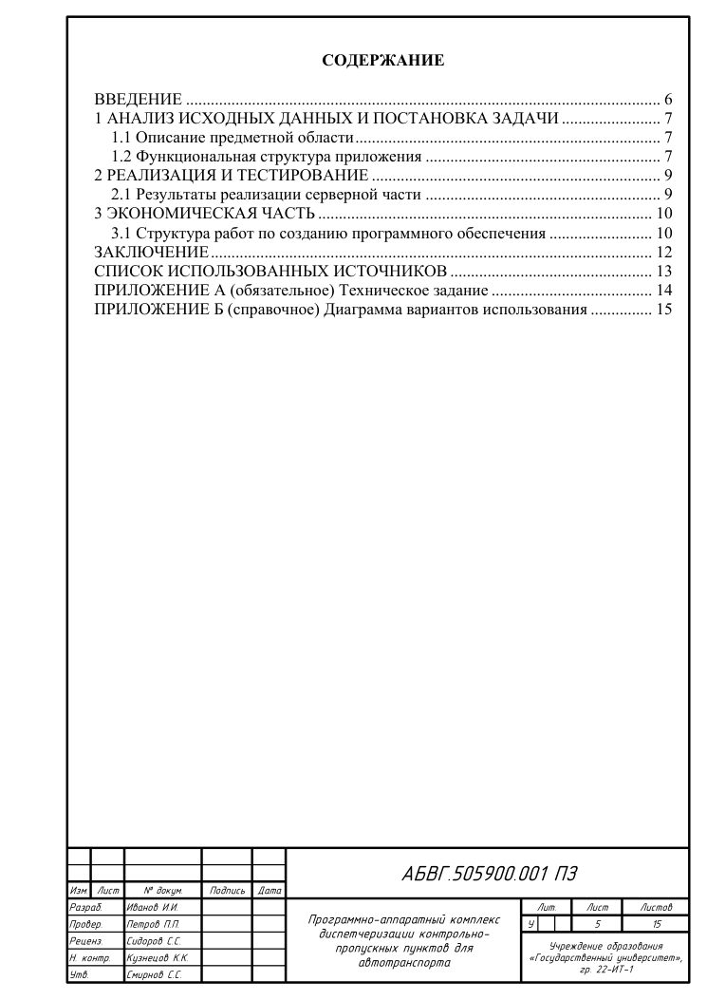
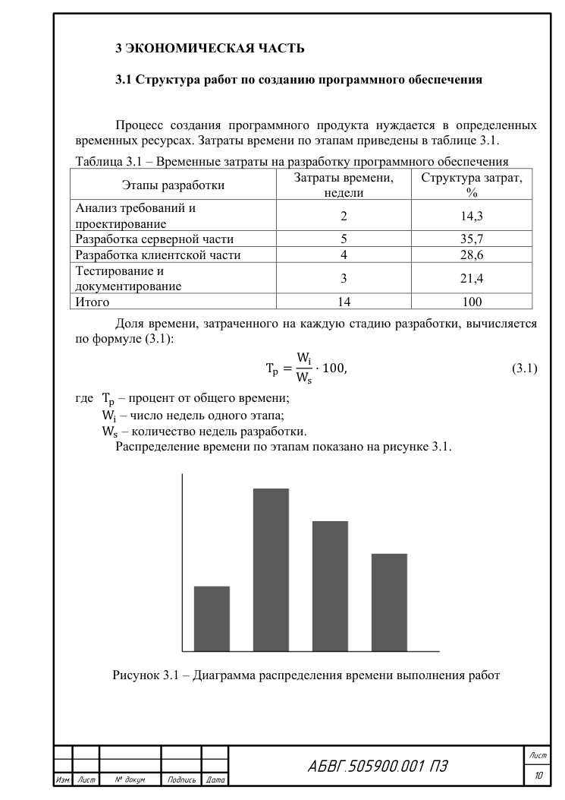

# gostdoc

**Write in Markdown and get a Word document formatted to GOST.**

`gostdoc` converts a Markdown file into a `.docx` that follows Russian/Belarusian document
standards: an ЕСКД пояснительная записка (ГОСТ 2.105 / 2.104) with the sheet frame and title
block, or a research report to ГОСТ 7.32-2017. You write the text and its structure. Fonts,
indents, numbering, captions, the table of contents and the frame are produced for you.

It is built to be driven by AI agents as well as people. The complete syntax is in one guide
that an agent can read (`gostdoc --guide`), and the repository includes `AGENTS.md`,
`llms.txt` and a Claude Code skill. See [Using with AI agents](#using-with-ai-agents).

<p align="center">
  
  &nbsp;
  
</p>

## Features

- **Two profiles**
  - `eskd` (default): sheet frame, title block form 2 on the first sheet and form 2a on the
    following sheets, Times New Roman 14, single spacing, 15 mm indent.
  - `gost732`: no frame, 1.5 spacing, margins 30/15/20/20 mm, page number at the bottom center.
- **Automatic numbering** of chapters, sections, figures, tables, listings, formulas and
  appendices, by chapter (`2.3`) or by appendix (`А.1`).
- **Cross-references**: `@fig:arch`, `@tbl:cost`, `@eq:share` → `(3.1)`, `[@src:book]` → `[1]`.
- **GOST captions**: «Рисунок 1.1 – …», «Таблица 2.1 – …», «Листинг 2.1 – …».
- **Formulas** written in LaTeX are converted to native Word equations (no LaTeX install
  needed). Numbers are aligned right, and the «где …» block is laid out automatically.
- **Table of contents**, list of sources, appendix headings (`ПРИЛОЖЕНИЕ А (обязательное)`).
- **Typography**: «ёлочки» quotes, en dashes, dash (`–`) and `1)` lists.
- **Optional Microsoft Word step** (Windows): fills in TOC page numbers and the sheet count,
  and exports PDF.

## Install

Python 3.10 or newer is required.

```bash
pip install git+https://github.com/catink123/gostdoc
```

For development:

```bash
git clone https://github.com/catink123/gostdoc
cd gostdoc
python -m venv .venv
.venv/Scripts/python -m pip install -e ".[dev]"     # Linux/macOS: .venv/bin/python
```

Optional:

- **Microsoft Word** (Windows). When it is found, `gostdoc` uses it to compute TOC page numbers
  and the sheet count, and to export PDF. Without Word, open the result and accept
  "Update fields?" (or press Ctrl+A, F9). In LibreOffice use Tools → Update → Update All.
- The **GOST type B** font, for the title block. Other parts of the document do not need it.

## Usage

```bash
gostdoc report.md                                 # writes report.docx
gostdoc report.md -o out.docx --pdf               # also export PDF (needs Word)
gostdoc report.md --profile gost732               # ГОСТ 7.32 report
gostdoc report.md -c settings.yaml                # settings that override the front matter
gostdoc report.md --word no                       # never start Word
gostdoc --guide                                   # print the full syntax guide
```

From Python:

```python
from gostdoc import convert
convert("report.md", "report.docx", {"profile": "eskd"}, use_word="auto")
```

Exit code `0` means success. Warnings such as `unresolved reference @fig:x` print to stderr.
Treat them as errors.

## Writing documents

The full reference is [gostdoc/AI_INSTRUCTIONS.md](gostdoc/AI_INSTRUCTIONS.md). It covers all
syntax, the GOST rules, every setting and a checklist. It is written for AI agents and works
just as well for people. [examples/example.md](examples/example.md) uses every feature. Run
`gostdoc examples/example.md` to see the output.

A short example:

```markdown
---
first_page_number: 5
stamp:
  designation: АБВГ.505900.001 ПЗ
  title: Название проекта
  organization: Университет, гр. 22-ИТ-1
  developer: Иванов И.И.
  checker: Петров П.П.
---

# ВВЕДЕНИЕ

Текст со ссылкой на рисунок @fig:arch и источник [@src:book].

# Анализ предметной области

## Описание

{#fig:arch width=150mm}

Table: Сравнение аналогов {#tbl:cmp}

| Система | Цена |
|---------|:----:|
| A       | 10   |

$$
T = \frac{a}{b},
$$ {#eq:t}

где $a$ – первое;
$b$ – второе.

# СПИСОК ИСПОЛЬЗОВАННЫХ ИСТОЧНИКОВ

1. Автор, А. Книга / А. Автор. – М.: Изд-во, 2020. – 100 с. {#src:book}

# ПРИЛОЖЕНИЕ А (обязательное) Техническое задание
```

## Using with AI agents

An agent can write the Markdown and run `gostdoc` to produce the final document.

| File | For |
|---|---|
| [`gostdoc/AI_INSTRUCTIONS.md`](gostdoc/AI_INSTRUCTIONS.md) | The authoring guide. It is installed with the package and printed by `gostdoc --guide`, so an agent that only has `pip install` can still read it. |
| [`skills/gostdoc/SKILL.md`](skills/gostdoc/SKILL.md) | A [Claude Code skill](https://docs.claude.com/en/docs/claude-code/skills). Copy the `skills/gostdoc` folder to `~/.claude/skills/` (or into a project's `.claude/skills/`). Claude then uses gostdoc whenever you ask for a GOST document. |
| [`AGENTS.md`](AGENTS.md) / [`CLAUDE.md`](CLAUDE.md) | Instructions picked up automatically by coding agents that open this repository. |
| [`llms.txt`](llms.txt) | An index of the docs for LLMs, following [llmstxt.org](https://llmstxt.org). |

With any other assistant (ChatGPT, Gemini, a chat UI), paste the output of `gostdoc --guide`
into the conversation and ask it to write the document as Markdown for gostdoc. Then convert
the result yourself.

## How it works

| File | Role |
|---|---|
| `gostdoc/mdparse.py` | Markdown (markdown-it-py) → block IR, captions, attributes, «где» blocks |
| `gostdoc/numbering.py` | GOST numbering and the label table |
| `gostdoc/render.py` | IR → .docx: styles, lists, tables, figures, formulas, TOC, page setup |
| `gostdoc/frame.py` | ЕСКД frame and title blocks (forms 2 / 2a) as page-anchored shapes in headers |
| `gostdoc/latex2omml.py` | A LaTeX subset → Office Math (OMML), with no external tools |
| `gostdoc/wordpost.py` | Optional Microsoft Word automation: update the TOC and fields, export PDF |
| `gostdoc/config.py` | Profiles and defaults |

Run the tests with `python -m pytest tests`. They do not need Word.

## Limitations

- The title page and the assignment sheet (задание) are not generated. Make them separately.
- Not supported: footnotes, merged table cells, landscape pages, images side by side, and the
  extra columns on the left of the frame (Инв. № подл. etc.).
- There are no «Продолжение таблицы» labels. Instead, the table header row repeats on every page.
- SVG images are not supported. Convert them to PNG.
- Only Word computes page numbers. Other editors need a manual field update.

## License

[MIT](LICENSE)
