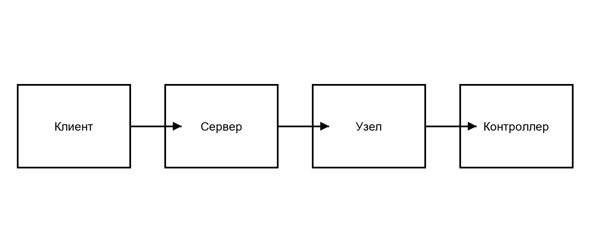

# ВВЕДЕНИЕ

В современных условиях развития транспортной и промышленной инфраструктуры обеспечение безопасности и автоматизация процессов контроля доступа становятся одними из приоритетных задач. Системы контроля и управления доступом (СКУД) для автотранспорта массово внедряются на распределенных объектах [@src:percoweb].

Целью дипломного проекта является разработка распределенного программно-аппаратного комплекса диспетчеризации контрольно-пропускных пунктов. Структура комплекса рассмотрена в подразделе @sec:struct, а расчеты экономической части – в разделе @sec:econ.

# Анализ исходных данных и постановка задачи

## Описание предметной области

Целевая аудитория комплекса – операторы-диспетчеры, контролирующие проезд транспорта на множестве удаленных объектов. Рабочий процесс диспетчера должен быть максимально удобным и оперативным.

Для реализации проекта необходимо выполнить следующие шаги:

- подобрать оптимальный набор технологий для серверной логики, оконечного оборудования и браузерного клиента;
- определиться с хранилищем данных для системы;
- выбрать стандарты связи для передачи видеосигнала и управляющих команд:
  - WebRTC для видеопотоков;
  - WebSocket для управляющих команд;
- составить исчерпывающую техническую документацию.

Архитектура системы должна состоять из трех изолированных слоев:

1. Центральный облачный ретранслятор.
2. Периферийная нода, отвечающая за трансляцию цифровых команд в физические сигналы.
3. Рабочее место оператора.

## Функциональная структура приложения {#sec:struct}

Функциональная структура комплекса представлена на рисунке @fig:arch. Взаимодействие блоков обеспечивает целостность работы комплекса: от физического управления шлагбаумом до отображения статуса на карте.

{#fig:arch width=160mm}

Ключевые параметры выбранных технологий приведены в таблице @tbl:tech.

Table: Сравнение языков программирования для серверной части {#tbl:tech}

| Язык       | Производительность | Простота разработки | Сетевые библиотеки |
|------------|:------------------:|:-------------------:|--------------------|
| C++        | высокая            | низкая              | Boost.Asio         |
| Node.js    | средняя            | высокая             | ws, socket.io      |
| Golang     | высокая            | высокая             | gorilla/websocket, pion/webrtc |

Для разработки центрального сервера и периферийного узла был выбран **Golang**. Его ключевое преимущество – компиляция в *единый* бинарный файл без внешних зависимостей (`CGO_ENABLED=0`).

# Реализация и тестирование

## Результаты реализации серверной части

Основная логика проверки прав доступа и валидации токенов представлена в листинге @lst:jwt.

Listing: Фрагмент промежуточного ПО (Middleware) для валидации токенов {#lst:jwt}

```go
func NewJWTMiddleware(jwtSecret string) gin.HandlerFunc {
    return func(c *gin.Context) {
        var tokenStr string
        if h := c.GetHeader("Authorization"); h != "" {
            tokenStr = strings.TrimPrefix(h, "Bearer ")
        }
        c.Next()
    }
}
```

Состояние узлов контролируется механизмом Heartbeat с периодом $T_h = 5$ с.

# Экономическая часть {#sec:econ}

## Структура работ по созданию программного обеспечения

Процесс создания программного продукта нуждается в определенных временных ресурсах. Затраты времени по этапам приведены в таблице @tbl:time.

Table: Временные затраты на разработку программного обеспечения {#tbl:time}

| Этапы разработки                         | Затраты времени, недели | Структура затрат, % |
|------------------------------------------|:-----------------------:|:-------------------:|
| Анализ требований и проектирование       | 2                       | 14,3                |
| Разработка серверной части               | 5                       | 35,7                |
| Разработка клиентской части              | 4                       | 28,6                |
| Тестирование и документирование          | 3                       | 21,4                |
| Итого                                    | 14                      | 100                 |

Доля времени, затраченного на каждую стадию разработки, вычисляется по формуле @eq:share:

$$
T_p = \frac{W_i}{W_s} \cdot 100,
$$ {#eq:share}

где $T_p$ – процент от общего времени;
$W_i$ – число недель одного этапа;
$W_s$ – количество недель разработки.

Распределение времени по этапам показано на рисунке @fig:chart.

{#fig:chart width=110mm}

Основная заработная плата рассчитывается по формуле @eq:salary:

$$
ЗО = \sum_{i=1}^{n} Т_{ч i} \cdot t_i \cdot К_{пр},
$$ {#eq:salary}

где $Т_{ч i}$ – часовая тарифная ставка $i$-го исполнителя, руб.;
$t_i$ – трудоемкость работ, выполняемых $i$-м исполнителем, ч;
$К_{пр}$ – коэффициент премий.

# ЗАКЛЮЧЕНИЕ

В ходе выполнения дипломного проекта спроектирован и реализован распределенный программно-аппаратный комплекс диспетчеризации. Требования технического задания (приложение @app:tz) выполнены в полном объеме.

# СПИСОК ИСПОЛЬЗОВАННЫХ ИСТОЧНИКОВ

1. Система контроля доступа PERCo-Web [Электронный ресурс]. – Режим доступа: https://www.perco.ru/products/perco-web/. – Дата доступа: 10.03.2026. {#src:percoweb}
2. Технология WebRTC API [Электронный ресурс]. – Режим доступа: https://developer.mozilla.org/ru/docs/Web/API/WebRTC_API. – Дата доступа: 12.03.2026. {#src:webrtc}
3. Калбертсон, Р. Быстрое тестирование / Р. Калбертсон, К. Браун, Г. Кобб. – М.: Вильямс, 2002. – 384 с. {#src:testing}

# ПРИЛОЖЕНИЕ А (обязательное) Техническое задание {#app:tz}

## Основание для разработки

Основанием для разработки является задание на дипломное проектирование. Общий вид тест-плана приведен в таблице @tbl:tests.

Table: Тест-план проверки веб-приложения {#tbl:tests}

| Тестовый вариант | Ожидаемый результат | Результат |
|------------------|---------------------|:---------:|
| Вход с верным паролем | Открыта рабочая область | Пройден |
| Вход с неверным паролем | Сообщение об ошибке | Пройден |

## Требования к надежности

Время восстановления после отказа не должно превышать значения, определяемого формулой

$$
t_{в} \le \frac{1}{\lambda} \ln \frac{1}{1 - P},
$$ {#eq:recovery}

где $\lambda$ – интенсивность отказов, 1/ч;
$P$ – требуемая вероятность восстановления.

# ПРИЛОЖЕНИЕ (справочное) Диаграмма вариантов использования

{width=100%}
